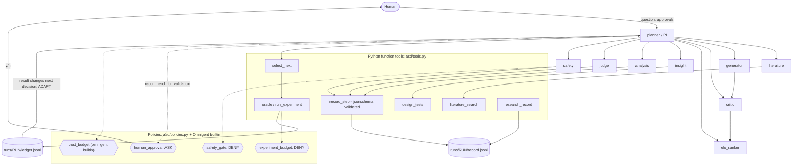
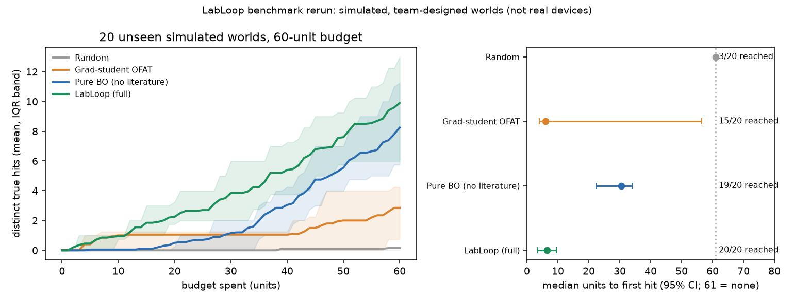

# agentic-scientific-discovery
Hack-Nation 7th Global AI Hackathon - Challenge 3: Agentic Scientific Discovery (Databricks x Hack-Nation).

## What it is
An Omnigent-orchestrated team of specialist agents (planner, literature, hypothesis generator, critic, Elo ranker, insight, analysis, judge, safety) that runs the full loop question -> evidence -> hypothesis -> experiment -> result -> updated decision under an enforced experiment budget and a human-approval policy, on two test beds: real public steel-strength data and a simulated perovskite lab on worlds no model can have seen.

**One-sentence claim.** On steel strength, a blinded LLM-prior plus Gaussian-process search found more hits per 60 experiments than one-factor-at-a-time and Bayesian optimisation (20 seeds, intervals below), but because the benchmark is public and our memorisation flag is set we make **no claim that LLM knowledge accelerates discovery**; on the LabLoop simulator the same decision strategy reaches its first hit far earlier than Bayesian optimisation alone (benchmark, not real devices).

## Headline results (with intervals and limits)
Complete and frozen for submission: an Omnigent-orchestrated agent team (planner + literature, insight, analysis, safety, judge, hypothesis generator, critic, Elo ranker) runs the full loop question -> evidence -> hypothesis -> experiment -> result -> updated decision on a replayed materials dataset, under an enforced experiment budget and a human-approval policy. 40 offline tests pass from a fresh clone. Headline: with blinded features (all element names hidden), an LLM-prior-guided search found 8.75 hits in 60 experiments vs 6.40 (OFAT) and 6.85 (BO) over 20 seeds (paired CI vs BO [+0.90, +2.95]). A pre-registered Ni/Mn label-swap test met its rule by the letter (8.10 hits, CI vs BO [+0.20, +2.30]), but the swap was a weak manipulation, so recall of this public benchmark cannot be excluded and we do not claim that LLM knowledge accelerates discovery (see Result, Counterfactual test (E1)).

| Component | Where | Evidence |
|---|---|---|
| Orchestrated loop with ADAPT after surprising results | `agents/planner.yaml`, `runs/t011` | H1, H2 refuted -> new H3 -> next experiment changed |
| Budget policy (DENY) | `asd/policies.py`, `runs/policy_demo` | 3rd reveal denied at budget 2 |
| Human-approval policy (ASK) | `runs/t011-repl30` | call held 22.2 s until a human clicked Approve |
| Baselines + LLM prior + memorisation control | `runs/t003`, `runs/t009` | Result section, `docs/headline.png` |
| Hypothesis arena (generator, critic, Elo) | `runs/arena`, `results/arena_calibration.json` | ranking not better than chance (p = 0.21) |
| Judge | `runs/*/judge.jsonl`, `results/judge_calibration.json` | n = 12; near-arithmetic check, not skill |
| Replay dashboard | `dashboard/app.py` | offline, `streamlit run dashboard/app.py` |

| Result | Number | Interval / n | Limit |
|---|---|---|---|
| Steel, blind prior+GP vs OFAT (hits@60) | 8.75 vs 6.40 | paired CI [+1.75, +3.00], 20 seeds | memorisation flag set: no acceleration claim |
| Steel, blind prior+GP vs BO (hits@60) | 8.75 vs 6.85 | paired CI [+0.90, +2.95], 20 seeds | same |
| LabLoop, full vs pure BO (hits@60, worlds 1000-1019) | 9.90 vs 8.25 | paired gap +1.65 [+0.05, +3.20], 20 world-seed pairs | marginal; simulator designed by the team |
| LabLoop, median units to first hit | 6.5 vs 30.5 | 20/20 vs 19/20 runs reached it | same |
| LabLoop, Omnigent live runs on worlds 2000-2002 | not measured in this repo | n = 0 committed | `runs/ll-w2000..2002` missing; see `docs/TODO_HUMAN.md` |

Details: steel in "Test bed 1" below; LabLoop in `docs/RESULTS_LABLOOP.md` (and `docs/RESULTS_LABLOOP_BIG.md` when present).

## Architecture

Solid arrows are data or calls; dotted arrows are policy checks that run before the tool executes.

## The two test beds
Two test beds, deliberately different. **Steel strength** (below) uses real public data, but the data has been public since 2018, so an LLM may recall it (memorisation flag set; no LLM-knowledge acceleration claim). **LabLoop** (`labloop/`, a teammate's work; `docs/LABLOOP_README.md`, contract in `docs/LABLOOP_INTEGRATION.md`) is a simulated halide-perovskite lab: 2,772 compositions, hidden physics redrawn per world id, target bandgap 1.24-1.38 eV with T80 >= 500 h, and a textbook prior under which no film qualifies. On unseen worlds recall is impossible. **The simulator was designed by our team and the worlds are synthetic: it is a benchmark, not evidence about real devices.** Omnigent orchestrates LabLoop through `agents/labloop_planner.yaml` and `asd/labloop_tools.py` (contract in `docs/LABLOOP_INTEGRATION.md`); live Omnigent runs on it are not yet committed (`docs/TODO_HUMAN.md`).

### Test bed 1: steel strength
**Question.** Can an agent team choose which experiments to run next so that it finds high-value candidates in fewer experiments than standard baselines, under a hard experiment budget and human approval for risky actions?
Test bed: `steel_strength` (312 steels, MIT, figshare 10.6084/m9.figshare.7250453; hit = yield strength >= 2000 MPa, 15 hits), replayed as an oracle that reveals one yield value per experiment.

**Bottleneck.** Experiments (here: oracle reveals) are the scarce resource. The measured quantity is hits within a budget B=60 and experiments to the k-th hit (k=1,3,5), against random, one-factor-at-a-time (OFAT) and Gaussian-process Bayesian optimisation (BO) at matched budget, pool, seeds and initial design (5 fixed rows).

**Result.** On steel_strength (Matbench steels, public since 2018), B=60, seeds 0-4, a static Sonnet 5.5 prior over all candidates raised mean hits@60 from 6.6 (OFAT, best non-LLM baseline) to 8.2 (prior + GP) and 13.2 (prior-only ranking) with named features. By our pre-registered rule this is NOT an acceleration claim: the memorisation probe's flag is set (guided prompt MAE 189 vs generic 255 MPa; 3/20 near-exact), so the advantage is consistent with memorisation of a public benchmark or a named-domain prior. The probe is weak evidence either way (n=20, default sampling, 15/20 probe rows cluster near 2400 MPa), so we cannot rule out or confirm recall. A blinded view (permuted, scaled, unnamed features) kept the prior+GP gain (8.4) but not the prior-only gain (8.2, one seed with 0 hits), and named first picks hit 5/5 vs blind 2/5. n=5 seeds; no significance claimed; the agent is not shown to learn faster.

Extended blind run (seeds 0-19, `scripts/t009_blind20.py`): blind llm_bo mean hits@60 is 8.75 vs OFAT 6.40 (19 wins/0 ties/1 loss, mean paired difference +2.35, bootstrap 95% CI [+1.75, +3.00], sign test p<0.001) and vs BO 6.85 (15/3/2, +1.90, CI [+0.90, +2.95], p=0.002); the memorisation flag remains set, so this is not an acceleration claim.


`docs/headline.png`: hits vs experiments used and experiments to the k-th hit (k=1,3,5), with IQR bands. random n=500 seeds, OFAT/BO/blind llm_bo n=20 seeds; the named-feature arm is n=5 with the memorisation flag set.

### Counterfactual test (E1)
Pre-registered in commit 92ca1e3 before any call (`knowledge/concepts/memorization-control.md`). The named prompt printed the Ni column as "Mn" and the Mn column as "Ni" (maraging Ni ~18 wt% reads as high-Mn); data, oracle and hit threshold unchanged (test: `tests/test_llm_prior.py`). Seeds 0-19, B=60, `scripts/e1_counterfactual.py`, `results/e1_counterfactual.json`.

| arm (mean hits@60) | cfnamed | blind | OFAT | BO |
|---|---|---|---|---|
| value | 8.10 | 8.75 | 6.40 | 6.85 |

Counterfactual vs OFAT: W/T/L 14/4/2, mean diff +1.70, bootstrap 95% CI [+0.80, +2.55]. Vs BO (the better baseline): 11/3/6, +1.25, CI [+0.20, +2.30]. Mean experiments to 1/3/5 hits: cfnamed 11.7/18.6/26.5, blind 11.1/18.4/27.4, OFAT 15.6/27.0/41.1, BO 18.0/25.4/42.2.

Decision rule (verbatim): "If counterfactual-named prior+GP beats the better of OFAT and BO on mean hits@60 with a paired bootstrap 95% CI excluding 0 over 20 seeds, recall of the true table cannot explain the gain, and we report an acceleration of hits-within-budget versus these baselines on this benchmark. Because the prior was given wrong element identities, this gain is NOT attributed to correct chemical knowledge. If it does not, we report that the named-prior gain depends on correct labels, consistent with recall or with a domain prior, and make no acceleration claim."
Outcome and interpretation (Scout review): As a counterfactual-naming control we swapped only the Ni and Mn labels (2 of 13), data untouched. The LLM+BO arm still beat the best baseline (BO) by +1.25 hits at 60 experiments (CI [+0.20, +2.30]; 11 wins, 3 ties, 6 losses over 20 seeds), so the pre-registered rule is met. This is a weak manipulation, though. On the 5 seeds with cached named priors, the swap lowered hits by about 1.4 and the prior ranking changed noticeably (Spearman 0.77, top-20 overlap about 9 of 20), but the priors stayed correlated, so recall from the unchanged columns cannot be excluded. The stronger evidence is the blinded arm, with all labels hidden, permuted and scaled: 8.75 hits vs BO 6.85 (+1.90, CI [+0.90, +2.95]), which shows the gain does not depend on element names.

Trust meter (`docs/trust_meter.png`): mean Spearman(prior, revealed y) is 0.48 at the last step for the counterfactual arm vs 0.35 for blind (0.56 vs 0.43 averaged over steps). It does not fall below blind, so the meter did NOT detect the misleading prior; the swapped-label prior still ranked candidates well on revealed data.


**Deviation: temperature.** The protocol specified temperature 0. The LLM calls went through the logged-in `claude` CLI, which cannot set temperature, so all probe and prior calls use default sampling with one cached sample per (prompt, model, seed). This adds sampling noise to the probe (P1 vs P2) and to every LLM arm. Other disclosed deviations: static per-candidate prior (not re-queried), no literature arm in the evaluation.

### Test bed 2: LabLoop results
All offline, deterministic, no model calls (`scripts/ll_benchmark.py`, `ll_calibrate.py`, `ll_misspec.py`, `ll_compare.py`; outputs `runs/ll_*.json`). Full tables and caveats: `docs/RESULTS_LABLOOP.md`.



- **Benchmark rerun** (worlds 1000-1019, 20 seeds, 60 units): LabLoop 9.90 hits [95% CI 8.25, 11.70] vs pure BO 8.25 [6.65, 9.75]; paired gap +1.65 [+0.05, +3.20] (marginal). Median first hit 6.5 vs 30.5 units, 20/20 vs 19/20 runs reaching it. All 8 rows of the teammate's README table reproduce exactly.
- **Judge vs hidden truth:** 119 confirmations, precision 0.96 [0.91, 0.98], recall 0.58 [0.51, 0.64] (conservative; misses true hits it never replicated).
- **Arena vs hidden truth:** Spearman(Elo, true share of region meeting spec) per-run mean 0.39 [0.28, 0.50]; random ordering about 0 (218 hypotheses, 20 runs; Elo is a proxy for relevance, not truth).
- **Prior misspecification:** belief revision adds +1.15 hits [+0.15, +2.40] when the prior is fully wrong, but costs hits when the prior is right (-2.60 [-3.55, -1.65]).
- **Golden worlds 2000-2002:** rule-based baseline recorded; the Omnigent comparison awaits live runs (the script reports missing records and is tested on a synthetic fixture).

Related work, each read by abstract only: Olympus (2021, benchmarking framework for noisy optimization and experiment planning), Atlas (Digital Discovery 2025, Bayesian optimization for self-driving labs), Rainbow (Nature Communications 2025, perovskite nanocrystal self-driving lab).

## How to run and reproduce (Windows, omnigent 0.16.0)
One command reproduces everything offline (no LLM calls: install, tests, baselines, judge and arena calibration, E1 stats from cache if present, plot, summary):
```
powershell -ExecutionPolicy Bypass -File scripts/reproduce.ps1      # or: bash scripts/reproduce.sh
```
Step by step:
```
uv tool install --python 3.12 omnigent --with jsonschema --with pyyaml    # PyPI; the git+https form fails on Windows (MAX_PATH)
pip install -r requirements.txt                                            # Python >= 3.12
python -m pytest -q                                                        # offline tests, no model needed
python scripts/demo_policies.py                                            # model-free: budget DENY + approval ASK
python scripts/run_baselines.py 20                                         # random/OFAT/BO, seeds 0-19 -> runs/t003 (offline)
python scripts/plot_headline.py                                            # -> docs/headline.png (needs cached runs/t009)
python scripts/t009_blind20.py                                             # blind llm_bo 0-19 + paired stats (cached; new calls spend tokens)
python scripts/calibrate_judge.py                                          # judge calibration -> results/judge_calibration.json
python scripts/calibrate_arena.py                                          # arena calibration -> results/arena_calibration.json
streamlit run dashboard/app.py                                             # offline replay dashboard
```
Live runs (spend model tokens; auth below):
```
powershell -ExecutionPolicy Bypass -File scripts/live.ps1 agents/hello.yaml "go"
powershell -ExecutionPolicy Bypass -File scripts/live.ps1 agents/planner.yaml "Run one loop ..."
powershell -ExecutionPolicy Bypass -File scripts/live.ps1 agents/policy_demo.yaml "go" -Interactive
```
`-Interactive` omits `-p` and starts the REPL so a policy ASK waits for a human `y/n` (do not attach a `-p` client and a browser at once: the `-p` client auto-declines).
Set `PYTHONUTF8=1` and `PYTHONIOENCODING=utf-8` (live.ps1 does). Auto-spawn of the local server can time out on Windows; live.ps1 starts it with `omnigent server --background` and uses `--server local`.
Auth: `claude-sdk` reads `CLAUDE_CODE_OAUTH_TOKEN` (or `ANTHROPIC_API_KEY`) from a gitignored `.env`, loaded into the process only; never put it in YAML or git.
Run records: `runs/<name>/record.jsonl`, `ledger.jsonl`, `meta.json` (binds run id, seed, budget), `session.jsonl`, `transcript.txt`. Run config (ASD_SEED, ASD_BUDGET, ASD_RUN_DIR, ASD_RUN_ID) reaches tool processes via LC_ASD_*; a tool refuses a foreign ledger.
Omnigent notes: single-file YAML, flat `executor: {harness, model}`; `tools: {x: inherit}` does NOT give sub-agents the parent's function tools in a live run, so declare tools explicitly inside each sub-agent.

## Agent specifications and policies
Omnigent orchestrates the live workflow. `agents/planner.yaml` is a PI/planner supervising literature, insight, analysis, safety and judge sub-agents plus the arena's generator, critic and Elo ranker (Sonnet 5.5 planner/insight/analysis/generator, Haiku 4.5 literature/safety/judge/critic/ranker; models pinned in each executor; tools declared per sub-agent). Other specs: `agents/hello.yaml` (smoke test), `agents/policy_demo.yaml` (live budget DENY + approval ASK), `agents/single_llm.yaml` (single-agent comparison, n=1, not a result).
The oracle, selector, hypothesis registry and research record are Python function tools (`asd/tools.py`); sub-agent outputs pass a jsonschema-validating `record_step` tool. Policies in `asd/policies.py`: `experiment_budget(limit=60)` DENYs reveals past the budget (attempts counted), and `human_approval(ask_after=30)` ASKs before validation recommendations; plus built-in `cost_budget` (hard stop needs `expensive_models: []`).

**Positioning.** SciAgents, as described in its method, generates and critiques hypotheses without running experiments; ours runs the experiment, records the result and lets it change the next decision.

File pointers: `agents/planner.yaml` (steel), `agents/labloop_planner.yaml` (LabLoop), `agents/hello.yaml`, `agents/policy_demo.yaml`, `agents/single_llm.yaml`; policies `asd/policies.py`; tools `asd/tools.py` (steel), `asd/labloop_tools.py` (LabLoop), `asd/labloop_mf_tools.py` (multi-fidelity), `asd/kg_tools.py` (knowledge graph); schemas `asd/schemas.py`.

### Human approval (policy ASK)
In an interactive run the approval policy holds the tool call until a human answers: in runs/t011-repl30 the call was held 22.2 s, with no automatic resolve, until the human clicked Approve. Non-interactive -p runs decline automatically (fail-closed).
Evidence for the 22.2 s hold: `runs/t011-repl30/APPROVAL_EVIDENCE.md`. Earlier evidence: `runs/t011-repl/APPROVAL_EVIDENCE.md` (the browser's resolve arrived first, 1.6 s) and `runs/t011-ask` (non-interactive `-p` run: the first ASK was declined automatically, Omnigent server log line 170; human decision recorded as `rec-0004`).

### Hypothesis arena

Generator (Sonnet 5.5) proposes 5 schema-validated hypotheses (seed 0, named steel domain: feature names and wt% ranges only, no candidate ids, dataset not named), a Haiku 4.5 critic attacks each and names one refuting test (shaped as a `design_tests` spec), and a Haiku 4.5 ranker runs one round of 10 pairwise Elo comparisons. A shallow OpenAlex title check labels novelty (1 "already reported", 4 "partly reported", 0 "no match found"; shallow keyword check, not proof of novelty). The pipeline follows the SciAgents idea as described in its method (agents turning structured hypotheses into critiqued proposals); we did not reproduce it.

Offline calibration (`scripts/calibrate_arena.py`, never visible to agents): each hypothesis predicts the mean yield of a composition region; the pool gives the true mean. 5/5 testable, 4/5 within 25 percent of the predicted value or range (regions of 7 to 66 steels). Spearman(Elo, realized accuracy) = 0.56; against 5000 random rankings one-sided p = 0.21, so not distinguishable from chance. Caveats: a measured mean inside a predicted range counts as zero error, so wide ranges score for free and "4/5 within 25 percent" overstates predictive precision; n = 5, one seed; calibrated against measured outcomes on a public benchmark, not expert review; the LLM may have memorised matbench_steels; the critic's refuting tests were not executed. Data: `runs/arena/`, `results/arena_calibration.json`.

#### Live end-to-end run (E2): what it did and did not show
`runs/e2-live` (seed 7, budget 8, headless; map in `runs/e2-live/SUMMARY.md`): every sub-agent ran as a live Omnigent session (literature, generator, critic, Elo ranker, insight, analysis x4, judge x4, safety). It ran 4 experiments with 0 hits. It did NOT contain an ADAPT step (the ADAPT example is `runs/t011`), did NOT execute the critic's refuting test (offered in design_tests only), and ended before the approval or safety-gate tools were called. The judge disagreed with the analysis on c068 (rec-0028).

### Hard gates vs soft checks
Enforced (the tool call does not run, or waits, regardless of what the model says):
- Experiment budget: `experiment_budget` policy DENYs `run_experiment` past the limit (`asd/policies.py`, `scripts/demo_policies.py`).
- Safety gate: `safety_gate` policy DENYs `propose_processing_route` / `recommend_for_validation` whose arguments name a flagged hazard (e.g. "molten salt without PPE"); tested through the Omnigent shim in `tests/test_omnigent.py`. It is a keyword list, not a hazard analysis; a hazard it does not list is not blocked. Not exercised in the live run `runs/e2-live` (the planner ended before calling the tool).
- Interactive approval hold: `human_approval` ASKs before `recommend_for_validation`; held 22.2 s until a human clicked Approve (runs/t011-repl30).
- `-p` (headless) fail-closed: an ASK is declined automatically.
Advisory only (recorded, never blocks): the judge verdict, the arena critic and Elo ranking, the literature novelty check (shallow keyword search), the "agent-generated" labels, and the planner's own prompt order (in `runs/e2-live` it skipped the ADAPT line and the final recommend/route calls).

Parallel sub-agents: Omnigent documents that several `sys_session_send` calls in one response dispatch concurrently (`omnigent/tools/builtins/spawn.py`). In `runs/e2-live` the planner issued two analysis sessions in one response (analysis-A, analysis-B, 3 s apart); see `runs/e2-live/SUMMARY.md`. The planner prompt requests this once; we did not benchmark speedup.

### Judge
A Haiku 4.5 judge scores each analysis conclusion with a 3-check rubric (supported by the ledger value, citations present, labelled agent-generated) and a low/medium/high confidence (`asd/judge.py`, `scripts/judge_runs.py`, verdicts in `runs/<run>/judge.jsonl`). Calibrated against measured outcomes on a public benchmark, not expert review: n=12 conclusions (runs t011, live1, live2), accuracy 1.00, Brier 0.060 (low=0.25, medium=0.5, high=0.85), bins low 0, medium 2, high 10 (`results/judge_calibration.json`). Caveats: n is tiny; the judge is shown the ledger value, so the outcome check is close to arithmetic and the result says little about scientific judgement; no low-confidence verdicts, so the reliability table is not informative; the benchmark may be memorised by LLMs.

## Responsible use
- **Agent-generated hypotheses.** Every hypothesis, analysis conclusion, judge verdict and recommendation in this repo is produced by LLM agents and is labelled agent-generated. None is a verified scientific finding. Predicted values are model output, not measurements.
- **Replayed data, not lab safety.** Experiments here are reveals from a fixed public table (no reagents, no hardware). The `safety_gate` is a keyword list over tool arguments, not a hazard analysis, and nothing here certifies that a process is safe to run in a lab.
- **Human approval before any real-world validation.** `human_approval` ASKs before `recommend_for_validation`; headless runs decline automatically. Do not act on a recommendation (synthesis, processing, testing) without domain-expert review and your institution's safety sign-off.
- **Dual use.** Candidate-ranking and route-proposal agents could in principle be pointed at hazardous materials or processes. The safety agent and gate reduce, but do not remove, that risk; keep a human in the loop and do not extend the hazard list by omission. Prior knowledge from an LLM can also be wrong or memorised (see Limitations).

### Validation needed before real use
Re-run on a dataset the model cannot have seen (post-cutoff or private); temperature-0 or multi-sample probes; larger probe set; more seeds for named arms; a real or higher-fidelity oracle; domain-expert review of recommendations and safety constraints; independent replication of the approval-hold test.

## Limitations
- steel_strength is a public benchmark (same 312 rows as Matbench steels): LLM arms may recall values; the memorisation flag is set, so no acceleration claim.
- Replay oracle over a fixed 312-row pool with 15 hits; not a real lab. Prior is static and the literature arm is not evaluated.
- Default sampling (no temperature 0); the 20-row probe is weak evidence. Named arms n=5; blind arm n=20; random n=500.
- Single live planner runs (seed 0 etc.) are demonstrations, not evidence of speedup; the single-LLM run is n=1.
- Human approval proven in one interactive run; headless runs decline ASKs.

## Next experiment
Repeat the matched comparison on a materials dataset published after the model's training cutoff (or held privately), with the blinded prior, temperature-0 or multi-sample probes, more seeds for the named arm, and the planner's adaptive loop evaluated against a scripted agent order.

## References
Systems we built on or compare to (details in `knowledge/papers/`):
- SciAgents: Ghafarollahi and Buehler (MIT), arXiv:2409.05556. Multi-agent hypothesis generation from an ontological knowledge graph; runs no experiments. Compared in Positioning and the arena. Only the first third of the paper was read.
- Coscientist: Boiko et al., Nature 2023, nature.com/articles/s41586-023-06792-0. GPT-4 agent with search, code execution and robotic lab control. Citation incomplete (title and page details not in our notes).
- A-Lab (Berkeley): robotic solid-state synthesis; claimed about 41-43 new materials in 17 days, disputed by independent analysis, with a Nature Author Correction in Jan 2026. Citation incomplete (no paper reference in our notes; sources: Chemistry World, C&EN).
- The AI Scientist v1/v2 (Sakana): arXiv:2408.06292, v2 arXiv:2504.08066.
- Google AI Co-Scientist: arXiv:2502.18864. Generate-debate-evolve with a tournament; the inspiration for the Elo arena.
- LGBO (LLM-guided Bayesian optimization): arXiv:2605.17976 (html v1). LLM preferences shift the GP surrogate mean; basis of our prior + GP arm. Authors not recorded in our notes.
- Language-guided priors and AWCD: doi:10.1021/acs.jcim.6c00976 (2026). An LLM turns expert prose into a BO prior mean; AWCD switches the prior off when data contradict it; basis of our trust meter. Authors and title not recorded in our notes (incomplete).
- Matbench steels dataset: figshare doi 10.6084/m9.figshare.7250453 (312 steels, MIT license per the figshare API; upstream Citrine dataset citrination.com/datasets/153092, whose license is unverified); the Matbench benchmark paper is not cited here (incomplete).
- Omnigent: Databricks, github.com/omnigent-ai/omnigent (Apache 2.0, alpha), PyPI `omnigent` 0.16.0, docs omnigent.ai.
- Olympus: Häse, Aldeghi, Hickman et al., "Olympus: a benchmarking framework for noisy optimization and experiment planning", Machine Learning: Science and Technology (2021), doi:10.1088/2632-2153/abedc8.
- Atlas: Hickman, Sim, Pablo-García et al., "Atlas: a brain for self-driving laboratories", Digital Discovery (2025), doi:10.1039/D4DD00115J.
- Rainbow: Xu, Moran, Ghorai et al., "Autonomous multi-robot synthesis and optimization of metal halide perovskite nanocrystals", Nature Communications (2025), doi:10.1038/s41467-025-63209-4.
- OpenAlex: used for a shallow title check of hypothesis novelty (arena). Citation incomplete (no reference in our notes).

## Live demo
`docs/index.html` is a self-contained, offline page (steel headline, LabLoop replay, an "Omnigent runs" tab fed by committed `runs/ll-*`). `vercel.json` serves `docs/` as static files with no build; the human deploy steps are in `docs/DEPLOY.md`. Live URL: [HUMAN: paste Vercel URL]. Local: open `docs/index.html`, or `streamlit run dashboard/app.py` (adds a "LabLoop (Omnigent)" tab). Rebuild after new runs: `python scripts/build_dashboard.py`. LabLoop is a simulated lab designed by the team: a benchmark, not evidence about real devices.

## Dashboard
Offline replay of committed runs and results (no LLM or network calls): `streamlit run dashboard/app.py`

## Team
Placeholders, to be filled by the team before submission (`docs/TODO_HUMAN.md`, item 6):
- [HUMAN: name, role]
- [HUMAN: name, role]
- [HUMAN: name, role]
Credit: the LabLoop simulator and rule-based agents (`labloop/`) were written by a teammate and integrated here.
