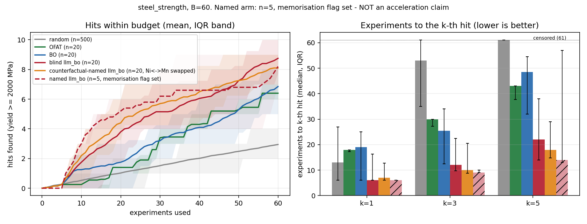
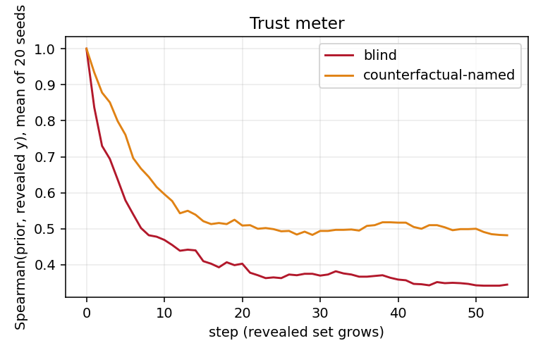

# agentic-scientific-discovery
Hack-Nation 7th Global AI Hackathon - Challenge 3: Agentic Scientific Discovery (multi-agent AI lab)

## Status (Oct 4)
Complete and frozen for submission: an Omnigent-orchestrated agent team (planner + literature, insight, analysis, safety, judge, hypothesis generator, critic, Elo ranker) runs the full loop question -> evidence -> hypothesis -> experiment -> result -> updated decision on a replayed materials dataset, under an enforced experiment budget and a human-approval policy. 37 offline tests pass from a fresh clone. Headline: with blinded features (all element names hidden), an LLM-prior-guided search found 8.75 hits in 60 experiments vs 6.40 (OFAT) and 6.85 (BO) over 20 seeds (paired CI vs BO [+0.90, +2.95]). A pre-registered Ni/Mn label-swap test met its rule by the letter (8.10 hits, CI vs BO [+0.20, +2.30]), but the swap was a weak manipulation, so recall of this public benchmark cannot be excluded and we do not claim that LLM knowledge accelerates discovery (see Result, Counterfactual test (E1)).

| Component | Where | Evidence |
|---|---|---|
| Orchestrated loop with ADAPT after surprising results | `agents/planner.yaml`, `runs/t011` | H1, H2 refuted -> new H3 -> next experiment changed |
| Budget policy (DENY) | `asd/policies.py`, `runs/policy_demo` | 3rd reveal denied at budget 2 |
| Human-approval policy (ASK) | `runs/t011-repl30` | call held 22.2 s until a human clicked Approve |
| Baselines + LLM prior + memorisation control | `runs/t003`, `runs/t009` | Result section, `docs/headline.png` |
| Hypothesis arena (generator, critic, Elo) | `runs/arena`, `results/arena_calibration.json` | ranking not better than chance (p = 0.21) |
| Judge | `runs/*/judge.jsonl`, `results/judge_calibration.json` | n = 12; near-arithmetic check, not skill |
| Replay dashboard | `dashboard/app.py` | offline, `streamlit run dashboard/app.py` |

## Question
Can an agent team choose which experiments to run next so that it finds high-value candidates in fewer experiments than standard baselines, under a hard experiment budget and human approval for risky actions?
Test bed: `steel_strength` (312 steels, MIT, figshare 10.6084/m9.figshare.7250453; hit = yield strength >= 2000 MPa, 15 hits), replayed as an oracle that reveals one yield value per experiment.

## Bottleneck
Experiments (here: oracle reveals) are the scarce resource. The measured quantity is hits within a budget B=60 and experiments to the k-th hit (k=1,3,5), against random, one-factor-at-a-time (OFAT) and Gaussian-process Bayesian optimisation (BO) at matched budget, pool, seeds and initial design (5 fixed rows).

## Result
On steel_strength (Matbench steels, public since 2018), B=60, seeds 0-4, a static Sonnet 5.5 prior over all candidates raised mean hits@60 from 6.6 (OFAT, best non-LLM baseline) to 8.2 (prior + GP) and 13.2 (prior-only ranking) with named features. By our pre-registered rule this is NOT an acceleration claim: the memorisation probe's flag is set (guided prompt MAE 189 vs generic 255 MPa; 3/20 near-exact), so the advantage is consistent with memorisation of a public benchmark or a named-domain prior. The probe is weak evidence either way (n=20, default sampling, 15/20 probe rows cluster near 2400 MPa), so we cannot rule out or confirm recall. A blinded view (permuted, scaled, unnamed features) kept the prior+GP gain (8.4) but not the prior-only gain (8.2, one seed with 0 hits), and named first picks hit 5/5 vs blind 2/5. n=5 seeds; no significance claimed; the agent is not shown to learn faster.

Extended blind run (seeds 0-19, `scripts/t009_blind20.py`): blind llm_bo mean hits@60 is 8.75 vs OFAT 6.40 (19 wins/0 ties/1 loss, mean paired difference +2.35, bootstrap 95% CI [+1.75, +3.00], sign test p<0.001) and vs BO 6.85 (15/3/2, +1.90, CI [+0.90, +2.95], p=0.002); the memorisation flag remains set, so this is not an acceleration claim.


`docs/headline.png`: hits vs experiments used and experiments to the k-th hit (k=1,3,5), with IQR bands. random n=500 seeds, OFAT/BO/blind llm_bo n=20 seeds; the named-feature arm is n=5 with the memorisation flag set.

### Counterfactual test (E1)
Pre-registered in commit 92ca1e3 before any call (`knowledge/concepts/memorization-control.md`). The named prompt printed the Ni column as "Mn" and the Mn column as "Ni" (maraging Ni ~18 wt% reads as high-Mn); data, oracle and hit threshold unchanged (test: `tests/test_llm_prior.py`). Seeds 0-19, B=60, `scripts/e1_counterfactual.py`, `results/e1_counterfactual.json`.

| arm (mean hits@60) | cfnamed | blind | OFAT | BO |
|---|---|---|---|---|
| value | 8.10 | 8.75 | 6.40 | 6.85 |

Counterfactual vs OFAT: W/T/L 14/4/2, mean diff +1.70, bootstrap 95% CI [+0.80, +2.55]. Vs BO (the better baseline): 11/3/6, +1.25, CI [+0.20, +2.30]. Mean experiments to 1/3/5 hits: cfnamed 11.7/18.6/26.5, blind 11.1/18.4/27.4, OFAT 15.6/27.0/41.1, BO 18.0/25.4/42.2.

Decision rule (verbatim): "If counterfactual-named prior+GP beats the better of OFAT and BO on mean hits@60 with a paired bootstrap 95% CI excluding 0 over 20 seeds, recall of the true table cannot explain the gain, and we report an acceleration of hits-within-budget versus these baselines on this benchmark. Because the prior was given wrong element identities, this gain is NOT attributed to correct chemical knowledge. If it does not, we report that the named-prior gain depends on correct labels, consistent with recall or with a domain prior, and make no acceleration claim."
Outcome and interpretation (Scout review): As a counterfactual-naming control we swapped only the Ni and Mn labels (2 of 13), data untouched. The LLM+BO arm still beat the best baseline (BO) by +1.25 hits at 60 experiments (CI [+0.20, +2.30]; 11 wins, 3 ties, 6 losses over 20 seeds), so the pre-registered rule is met. This is a weak manipulation, though. On the 5 seeds with cached named priors, the swap lowered hits by about 1.4 and the prior ranking changed noticeably (Spearman 0.77, top-20 overlap about 9 of 20), but the priors stayed correlated, so recall from the unchanged columns cannot be excluded. The stronger evidence is the blinded arm, with all labels hidden, permuted and scaled: 8.75 hits vs BO 6.85 (+1.90, CI [+0.90, +2.95]), which shows the gain does not depend on element names.

Trust meter (`docs/trust_meter.png`): mean Spearman(prior, revealed y) is 0.48 at the last step for the counterfactual arm vs 0.35 for blind (0.56 vs 0.43 averaged over steps). It does not fall below blind, so the meter did NOT detect the misleading prior; the swapped-label prior still ranked candidates well on revealed data.



**Deviation: temperature.** The protocol specified temperature 0. The LLM calls went through the logged-in `claude` CLI, which cannot set temperature, so all probe and prior calls use default sampling with one cached sample per (prompt, model, seed). This adds sampling noise to the probe (P1 vs P2) and to every LLM arm. Other disclosed deviations: static per-candidate prior (not re-queried), no literature arm in the evaluation.

## Agents, specs and policies
Omnigent orchestrates the live workflow. `agents/planner.yaml` is a PI/planner supervising literature, insight, analysis, safety and judge sub-agents plus the arena's generator, critic and Elo ranker (Sonnet 5.5 planner/insight/analysis/generator, Haiku 4.5 literature/safety/judge/critic/ranker; models pinned in each executor; tools declared per sub-agent). Other specs: `agents/hello.yaml` (smoke test), `agents/policy_demo.yaml` (live budget DENY + approval ASK), `agents/single_llm.yaml` (single-agent comparison, n=1, not a result).
The oracle, selector, hypothesis registry and research record are Python function tools (`asd/tools.py`); sub-agent outputs pass a jsonschema-validating `record_step` tool. Policies in `asd/policies.py`: `experiment_budget(limit=60)` DENYs reveals past the budget (attempts counted), and `human_approval(ask_after=30)` ASKs before validation recommendations; plus built-in `cost_budget` (hard stop needs `expensive_models: []`).

**Positioning.** SciAgents, as described in its method, generates and critiques hypotheses without running experiments; ours runs the experiment, records the result and lets it change the next decision.

## Human approval (policy ASK)
In an interactive run the approval policy holds the tool call until a human answers: in runs/t011-repl30 the call was held 22.2 s, with no automatic resolve, until the human clicked Approve. Non-interactive -p runs decline automatically (fail-closed).
Evidence for the 22.2 s hold: `runs/t011-repl30/APPROVAL_EVIDENCE.md`. Earlier evidence: `runs/t011-repl/APPROVAL_EVIDENCE.md` (the browser's resolve arrived first, 1.6 s) and `runs/t011-ask` (non-interactive `-p` run: the first ASK was declined automatically, Omnigent server log line 170; human decision recorded as `rec-0004`).

## How to run from a clean clone (Windows, omnigent 0.16.0)
```
uv tool install --python 3.12 omnigent --with jsonschema --with pyyaml    # PyPI; the git+https form fails on Windows (MAX_PATH)
pip install -r requirements.txt                                            # Python >= 3.12
python -m pytest -q                                                        # offline tests, no model needed
python scripts/demo_policies.py                                            # model-free: budget DENY + approval ASK
python scripts/run_baselines.py 20                                         # random/OFAT/BO, seeds 0-19 -> runs/t003 (offline)
python scripts/plot_headline.py                                            # -> docs/headline.png (needs cached runs/t009)
python scripts/t009_blind20.py                                             # blind llm_bo 0-19 + paired stats (cached; new calls spend tokens)
python scripts/calibrate_judge.py                                          # judge calibration -> results/judge_calibration.json
python scripts/calibrate_arena.py                                          # arena calibration -> results/arena_calibration.json
streamlit run dashboard/app.py                                             # offline replay dashboard
```
Live runs (spend model tokens; auth below):
```
powershell -ExecutionPolicy Bypass -File scripts/live.ps1 agents/hello.yaml "go"
powershell -ExecutionPolicy Bypass -File scripts/live.ps1 agents/planner.yaml "Run one loop ..."
powershell -ExecutionPolicy Bypass -File scripts/live.ps1 agents/policy_demo.yaml "go" -Interactive
```
`-Interactive` omits `-p` and starts the REPL so a policy ASK waits for a human `y/n` (do not attach a `-p` client and a browser at once: the `-p` client auto-declines).
Set `PYTHONUTF8=1` and `PYTHONIOENCODING=utf-8` (live.ps1 does). Auto-spawn of the local server can time out on Windows; live.ps1 starts it with `omnigent server --background` and uses `--server local`.
Auth: `claude-sdk` reads `CLAUDE_CODE_OAUTH_TOKEN` (or `ANTHROPIC_API_KEY`) from a gitignored `.env`, loaded into the process only; never put it in YAML or git.
Run records: `runs/<name>/record.jsonl`, `ledger.jsonl`, `meta.json` (binds run id, seed, budget), `session.jsonl`, `transcript.txt`. Run config (ASD_SEED, ASD_BUDGET, ASD_RUN_DIR, ASD_RUN_ID) reaches tool processes via LC_ASD_*; a tool refuses a foreign ledger.
Omnigent notes: single-file YAML, flat `executor: {harness, model}`; `tools: {x: inherit}` does NOT give sub-agents the parent's function tools in a live run, so declare tools explicitly inside each sub-agent.

## Hypothesis arena

Generator (Sonnet 5.5) proposes 5 schema-validated hypotheses (seed 0, named steel domain: feature names and wt% ranges only, no candidate ids, dataset not named), a Haiku 4.5 critic attacks each and names one refuting test (shaped as a `design_tests` spec), and a Haiku 4.5 ranker runs one round of 10 pairwise Elo comparisons. A shallow OpenAlex title check labels novelty (1 "already reported", 4 "partly reported", 0 "no match found"; shallow keyword check, not proof of novelty). The pipeline follows the SciAgents idea as described in its method (agents turning structured hypotheses into critiqued proposals); we did not reproduce it.

Offline calibration (`scripts/calibrate_arena.py`, never visible to agents): each hypothesis predicts the mean yield of a composition region; the pool gives the true mean. 5/5 testable, 4/5 within 25 percent of the predicted value or range (regions of 7 to 66 steels). Spearman(Elo, realized accuracy) = 0.56; against 5000 random rankings one-sided p = 0.21, so not distinguishable from chance. Caveats: a measured mean inside a predicted range counts as zero error, so wide ranges score for free and "4/5 within 25 percent" overstates predictive precision; n = 5, one seed; calibrated against measured outcomes on a public benchmark, not expert review; the LLM may have memorised matbench_steels; the critic's refuting tests were not executed. Data: `runs/arena/`, `results/arena_calibration.json`.

## Judge
A Haiku 4.5 judge scores each analysis conclusion with a 3-check rubric (supported by the ledger value, citations present, labelled agent-generated) and a low/medium/high confidence (`asd/judge.py`, `scripts/judge_runs.py`, verdicts in `runs/<run>/judge.jsonl`). Calibrated against measured outcomes on a public benchmark, not expert review: n=12 conclusions (runs t011, live1, live2), accuracy 1.00, Brier 0.060 (low=0.25, medium=0.5, high=0.85), bins low 0, medium 2, high 10 (`results/judge_calibration.json`). Caveats: n is tiny; the judge is shown the ledger value, so the outcome check is close to arithmetic and the result says little about scientific judgement; no low-confidence verdicts, so the reliability table is not informative; the benchmark may be memorised by LLMs.

## Dashboard
Offline replay of committed runs and results (no LLM or network calls): `streamlit run dashboard/app.py`

## Limitations
- steel_strength is a public benchmark (same 312 rows as Matbench steels): LLM arms may recall values; the memorisation flag is set, so no acceleration claim.
- Replay oracle over a fixed 312-row pool with 15 hits; not a real lab. Prior is static and the literature arm is not evaluated.
- Default sampling (no temperature 0); the 20-row probe is weak evidence. Named arms n=5; blind arm n=20; random n=500.
- Single live planner runs (seed 0 etc.) are demonstrations, not evidence of speedup; the single-LLM run is n=1.
- Human approval proven in one interactive run; headless runs decline ASKs.

## Next experiment
Repeat the matched comparison on a materials dataset published after the model's training cutoff (or held privately), with the blinded prior, temperature-0 or multi-sample probes, more seeds for the named arm, and the planner's adaptive loop evaluated against a scripted agent order.

## Validation needed before real use
Re-run on a dataset the model cannot have seen (post-cutoff or private); temperature-0 or multi-sample probes; larger probe set; more seeds for named arms; a real or higher-fidelity oracle; domain-expert review of recommendations and safety constraints; independent replication of the approval-hold test.
